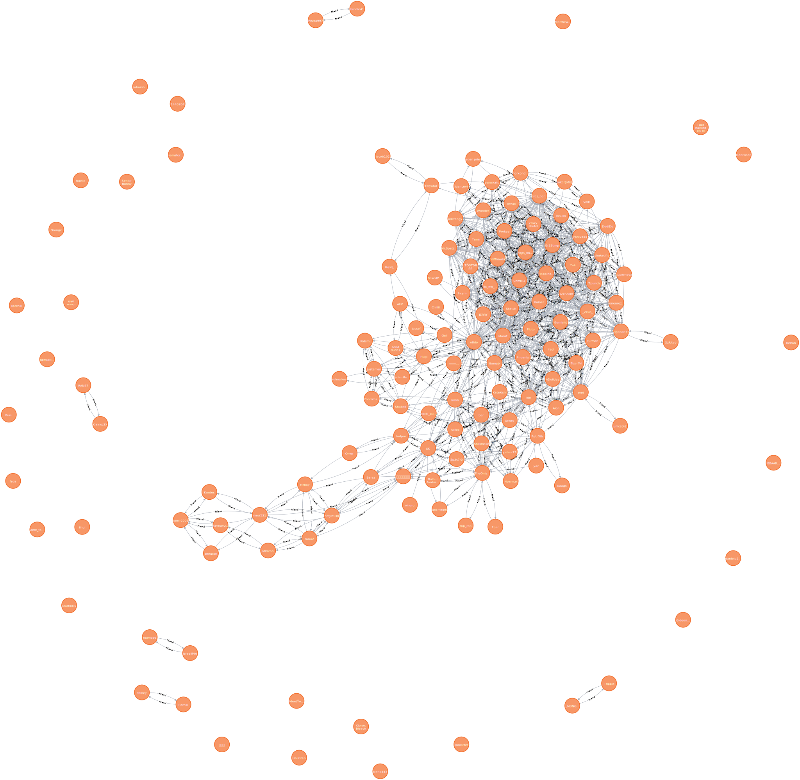

# Discord-Friend-Visualize

* using neo4j and data extracted from the discord API



### Setup 🔧

* All the scraped data is first saved to json files and then saved to neo4j.


0. Use neo4j Aura or run locally with Docker

`bash ./init.sh`


1. Create an .env file with your credentials

```
DISCORD_TOKEN=""
URI=""
USERNAME=""
PASSWORD=""
```

2. get all the friends and their mutual friends.

`go run ./DataScrape/scrape.go`

3. get your user data

`go run ./DataScrape/getOwnData.go`

4. Insert it all into neo4j and visualize

`go run main.go`
    
